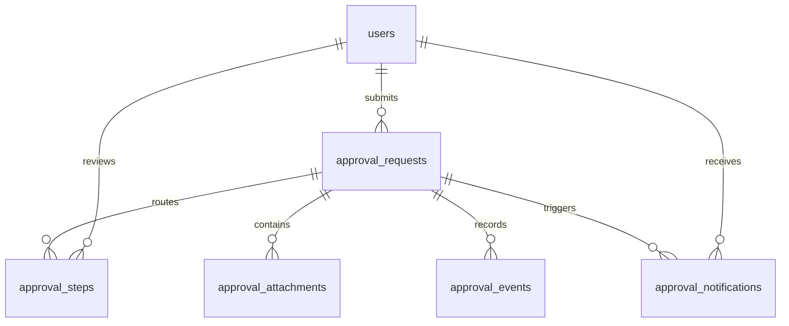

# หลักฐาน CRUD กับ Database ผ่าน API

## Stack ตรงตามเงื่อนไข

| เงื่อนไข | หลักฐานในโค้ด |
|---|---|
| Laravel 12 | `composer.json`: `laravel/framework: ^12.0` |
| React + Inertia | `resources/js/app.jsx`: `createInertiaApp`, `createRoot` |
| Tailwind CSS | `resources/css/app.css` มี `@tailwind`; `tailwind.config.js` สแกน JSX/Blade |
| Laravel Breeze Authentication | `laravel/breeze: ^2.4`, `routes/auth.php`, `app/Http/Controllers/Auth/` |
| Database ผ่าน API | React เรียก Axios → `/api/approvals` → Laravel Controller → Eloquent/SQL → SQLite |

ใช้ API แบบ same-origin JSON โดยยืนยันตัวตนด้วย session ของ Breeze และป้องกัน CSRF ผ่าน Laravel web middleware ดังนั้นแม้ routes จะไม่ได้อยู่ใน `routes/api.php` ก็ยังเป็น API ที่ React เรียกเพื่ออ่านและเขียนฐานข้อมูลจริง

## CRUD ทำงานตรงไหน

| ขั้น | HTTP API | ผลใน Database |
|---|---|---|
| Create | `POST /api/approvals` | `INSERT` แถวใหม่ใน `approval_requests` และประวัติใน `approval_events` |
| Read | `GET /api/approvals/{id}` | `SELECT` ข้อมูลจากฐานข้อมูล โดยตรวจสิทธิ์ผู้ใช้ |
| Update | `PUT /api/approvals/{id}` | `UPDATE` แถวเดิมและเพิ่มค่า `version` |
| Delete request | `DELETE /api/approvals/{id}` | Soft delete: ตั้งค่า `deleted_at`; รายการปกติไม่แสดงและ API ตอบ 404 |
| Delete attachment | `DELETE /api/approvals/{id}/attachments/{fileId}` | ลบแถว `approval_attachments` จริง และลบไฟล์จาก private storage |

Soft delete เก็บคำร้องไว้เพื่อ audit จึงต้องอธิบายให้ผู้ประเมินเห็นว่าเป็นการลบเชิงตรรกะ ไม่ใช่ SQL `DELETE` ของแถวคำร้อง หากต้องการสาธิตการลบแถวจริง ให้สาธิตการเพิ่มและลบไฟล์แนบด้วย

## วิธีสาธิตให้อาจารย์ดู

1. เข้าระบบด้วยบัญชีพนักงาน เปิด DevTools → Network → Fetch/XHR
2. สร้างคำร้องงบประมาณชื่อ `CRUD verification classroom` ใส่จำนวนเงิน 24,680.50 บาท แล้วบันทึกเป็น draft
3. ดู `POST /api/approvals` ตอบ **201** พร้อม `id` และ `version: 1`
4. Refresh หรือเปิด browser session ใหม่และเข้าสู่ระบบอีกครั้ง ข้อมูลเดิมต้องยังอยู่
5. แก้ไขจำนวนเงินเป็น 31,415.90 บาท ดู `PUT` ตอบ **200** พร้อม `version: 2`
6. ลบคำร้อง ดู `DELETE` ตอบ **204** แล้ว `GET` ด้วย ID เดิมต้องตอบ **404**
7. ให้ผู้ดูแลรันคำสั่งด้านล่างบนเครื่องที่เก็บฐานข้อมูล หรือใช้ GitHub Actions workflow **Read synthetic CRUD database evidence** ระบุ ID ที่ได้

```bash
php artisan approvals:crud-proof 123
```

แทน `123` ด้วย ID จริง คำสั่งอ่าน SQL โดยตรงและข้าม soft-delete scope เพื่อแสดงแถวที่ถูกลบเชิงตรรกะ รวมถึง `deleted_at`, `version`, จำนวนเงิน และประวัติ created/updated/deleted คำสั่งจำกัดเฉพาะชื่อที่เริ่มด้วย `CRUD verification ` และไม่แสดงข้อมูลบัญชีหรือเนื้อหาคำร้องจริง

## หลักฐานจาก automated tests

`tests/Feature/ApprovalWorkspaceTest.php::test_full_database_crud_with_version_and_history` ใช้ `assertDatabaseHas`, `assertSoftDeleted` และ API assertions โดยใช้ฐานข้อมูล SQLite สำหรับทดสอบ ไม่ใช่ mock array ใน React

`tests/Feature/ApprovalAttachmentTest.php` ตรวจด้วย `assertDatabaseMissing` ว่าแถวไฟล์แนบถูกลบจริง พร้อมตรวจว่าไฟล์ถูกลบจาก storage

ฐานข้อมูลทดสอบถูกแยกจาก production การผ่าน tests เป็นหลักฐานพฤติกรรมของโค้ด ส่วนผลอ่าน SQL จาก workflow เป็นหลักฐานจากฐานข้อมูลบน server จริง

## โครงสร้างข้อมูล


